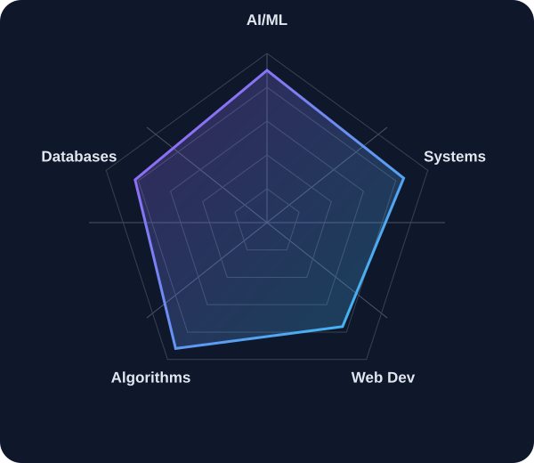
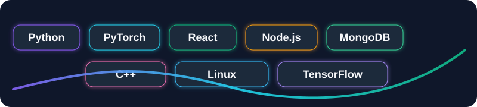

  

  

  <table>
    <tr>
      <td width="33%" style="padding: 12px; background: rgba(168,85,247,0.10); border: 1px solid rgba(168,85,247,0.35); border-radius: 12px;">
        <strong>⚙️ AI Systems</strong>
      </td>
      <td width="33%" style="padding: 12px; background: rgba(34,211,238,0.10); border: 1px solid rgba(34,211,238,0.35); border-radius: 12px;">
        <strong>🧠 Problem Solving</strong>
      </td>
      <td width="33%" style="padding: 12px; background: rgba(16,185,129,0.10); border: 1px solid rgba(16,185,129,0.35); border-radius: 12px;">
        <strong>🚀 Product Thinking</strong>
      </td>
    </tr>
  </table>

---

  
  
  
  

---

## **🎯 About Me**

  <table style="width: 100%; border-collapse: separate; border-spacing: 0;">
    <tr>
      <td width="100%" valign="top" style="padding: 24px; background: linear-gradient(135deg, rgba(168,85,247,0.12), rgba(34,211,238,0.08)); border: 1px solid rgba(148,163,184,0.35); border-radius: 18px; box-shadow: 0 0 0 1px rgba(255,255,255,0.04), 0 10px 30px rgba(168,85,247,0.12); transition: transform 0.2s ease, box-shadow 0.2s ease;">
        
<b>AI + Systems + Product</b>

        
I build production-ready systems that solve real problems. My work sits at the intersection of <b>AI/ML</b>, <b>backend architecture</b>, and <b>web development</b>.

        
I’m a CS student focused on building practical AI tools, scalable systems, and polished product experiences that turn ideas into working software.

        

          
          
          
          
        

      </td>
    </tr>
    <tr>
      <td style="padding-top: 8px;">
        

      </td>
    </tr>
  </table>

---

## **🚀 Featured Projects**

  

<table>
  <tr>
    <td width="50%" style="padding: 16px; background: rgba(168,85,247,0.06); border: 1px solid rgba(168,85,247,0.22); border-radius: 16px;">
      <h3>📚 Course-in-LLMs</h3>
      
Deep dive into LLM architecture, fine-tuning, and deployment. Hands-on implementations from scratch.

      

        
        
        
      

      <a href="https://github.com/Nausheen2206/Course-in-LLM-s">View Project →</a>
    </td>
    <td width="50%" style="padding: 16px; background: rgba(34,211,238,0.06); border: 1px solid rgba(34,211,238,0.22); border-radius: 16px;">
      <h3>🔥 Enterprise Network Firewall</h3>
      
Systems-level firewall simulation. Packet filtering, rule engine, real network protocols.

      

        
        
        
      

      <a href="https://github.com/Nausheen2206/Enterprise-Network-Firewall">View Project →</a>
    </td>
  </tr>
  <tr>
    <td width="50%" style="padding: 16px; background: rgba(16,185,129,0.06); border: 1px solid rgba(16,185,129,0.22); border-radius: 16px;">
      <h3>🔍 Code Plagiarism Detector</h3>
      
ML-powered code similarity engine using AST analysis. 95%+ accuracy on detection.

      

        
        
        
      

      <a href="https://github.com/Nausheen2206/CodePlagiarismDetector">View Project →</a>
    </td>
    <td width="50%" style="padding: 16px; background: rgba(251,191,36,0.06); border: 1px solid rgba(251,191,36,0.22); border-radius: 16px;">
      <h3>🎮 Crossword Puzzle Game</h3>
      
Interactive puzzle solver with AI hint generation. Full UI with word database.

      

        
        
        
      

      <a href="https://github.com/Nausheen2206/Crossword-Puzzle-Game">View Project →</a>
    </td>
  </tr>
  <tr>
    <td width="100%" colspan="2" style="padding: 18px; background: rgba(244,114,182,0.06); border: 1px solid rgba(244,114,182,0.22); border-radius: 16px;">
      <h3>🤖 StudyFlow AI</h3>
      
Adaptive learning assistant powered by LLMs. Personalized study paths, smart Q&A, spaced repetition.

      

        
        
        
        
      

      <a href="https://github.com/Nausheen2206/studyflow-ai">View Project →</a>
    </td>
  </tr>
</table>

---

## **📊 Skills & Tech Stack**

  

### **Frameworks & Tools**

  

### **Core Strengths**

  <table>
    <tr>
      <td width="33%" style="padding: 12px; background: rgba(168,85,247,0.10); border: 1px solid rgba(168,85,247,0.35); border-radius: 12px;">
        <strong>🤖 AI & LLMs</strong>
      </td>
      <td width="33%" style="padding: 12px; background: rgba(34,211,238,0.10); border: 1px solid rgba(34,211,238,0.35); border-radius: 12px;">
        <strong>🧠 Systems</strong>
      </td>
      <td width="33%" style="padding: 12px; background: rgba(16,185,129,0.10); border: 1px solid rgba(16,185,129,0.35); border-radius: 12px;">
        <strong>🌐 Web</strong>
      </td>
    </tr>
    <tr>
      <td width="33%" style="padding: 12px; background: rgba(56,189,248,0.08); border: 1px solid rgba(56,189,248,0.30); border-radius: 12px;">
        <strong>📚 DSA</strong>
      </td>
      <td width="33%" style="padding: 12px; background: rgba(251,191,36,0.08); border: 1px solid rgba(251,191,36,0.30); border-radius: 12px;">
        <strong>🖥️ OS</strong>
      </td>
      <td width="33%" style="padding: 12px; background: rgba(244,114,182,0.08); border: 1px solid rgba(244,114,182,0.30); border-radius: 12px;">
        <strong>📡 Networks</strong>
      </td>
    </tr>
  </table>

